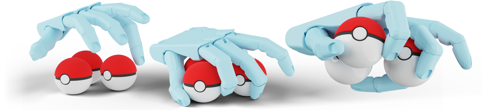
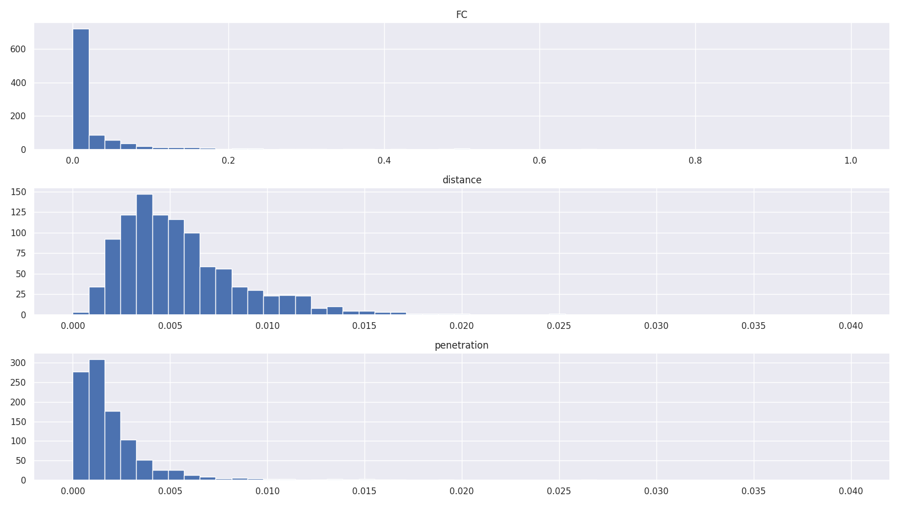

# Grasp Multiple Objects with One Hand

[Yuyang Li](https://yuyangli.com/),
[Bo Liu](https://benjamin-eecs.github.io/),
[Yiran Geng](https://https//gengyiran.github.io),
[Puhao Li](https://xiaoyao-li.github.io/),
[Yaodong Yang](https://www.yangyaodong.com/),
[Yixin Zhu](https://yzhu.io),
[Tengyu Liu](https://tengyu.ai),
[Siyuan Huang](https://siyuanhuang.com/)

<p align="left">
    <a href='https://multigrasp.github.io/'>
      
    </a>
</p>

Published in IEEE Robotics and Automation Letters (Volume: 9, Issue: 5, May 2024).

```bibtex
@article{li2024grasp,
    author={Li, Yuyang and Liu, Bo and Geng, Yiran and Li, Puhao and Yang, Yaodong and Zhu, Yixin and Liu, Tengyu and
    Huang, Siyuan},
    title={Grasp Multiple Objects with One Hand},
    journal={IEEE Robotics and Automation Letters},
    volume={9},
    number={5},
    pages={4027-4034},
    year={2024},
    doi={10.1109/LRA.2024.3374190}
}
```



## Multi-Object Grasp Synthesis

### Environment Setup

We recommend using Conda to create a virtual environment. To install dependencies:

```shell
pip install -r requirements.txt
```

The code in this repo is tested with:

- CUDA 12.2
- PyTorch 2.2.1
- Python 3.9

#### Install Customized `pytorch_kinematics`

We use a customized `pytorch_kinematics` for batched forward kinematics.:

```shell
cd thirdparty/pytorch_kinematics
pip install -e .
```

#### Install PyTorch3D with CUDA Support

Please refer to [Installing PyTorch3D](https://github.com/facebookresearch/pytorch3d/blob/main/INSTALL.md) to install PyTorch3D with CUDA support.

### Grasp Synthesis

Use the following code to synthesize grasps.

```bash
python run.py [--object_models OBJECT_MODELS [OBJECT_MODELS ...]]
              [--hand_model HAND_MODEL]
              [--batch_size BATCH_SIZE]
              [--max_physics MAX_PHYSICS]
              [--max_refine MAX_REFINE]
              [--n_contact N_CONTACT]
              [--hc_pen]
              [--viz]
              [--log]
              [--levitate]
              [--seed SEED]
              [--tag TAG]
              ... # See arguments
```

Explainations:

- `--hand_model`: Hand model for synthesizing grasps. `"shadowhand"` by default.
- `--object_models`: Specify names for objects one by one.
- `--batch_size`: Specify parallel batch size for synthesis.
- `--max_physics`, `--max_refines`: steps for the two optimization stages.
- `--n_contact`: Amount of contact points for each object, `3` by default.
- `--hc_pen`: Enable hand-penetration energy.
- `--viz`, `--log`: Enable periodical visualization and logging.
- `--levitate`: Synthesize grasps for levitating objects (rather than ones on the tabletop).
- `--seed`: Specify the seed, `42` by default.
- `--tag`: Tag for the synthesis.

For more arguments, please check `run.py`

As an example:

```shell
python run.py --object_models duck cylinder --seed 42 --batch_size 1024 --tag demo
```

The result will be in `synthesis/[HAND_MODEL]/[YYYY-MM]/[DD]/...`, where you can find an existing example.

### Filter Grasps and Visualize

Use `filter.py` to filter the result to remove bad samples and visualize the final grasps.

1. Input all the folders of the synthesis (under `synthesis/[HAND_MODEL]/[YYYY-MM]/[DD]/...`) into the `paths` list in `filter.py`.
2. Run `python filter.py`. You can adjust the filter thresholds in the code (`XXX_thres`).
3. Go to folders of each synthesis to check the visualization.

You can see the grasps as HTML files ([example 1](synthesis/shadowhand/2024-03/07/23-50-59_duck+cylinder-seed_42-demo/plot/19_e27c7097-3583-4c5e-a972-7fe87626c3d5.html), [example 2](synthesis/shadowhand/2024-03/07/23-50-59_duck+cylinder-seed_42-demo/plot/25_6256ae75-c404-4dbf-9a01-6050d7232f2c.html)), and also a histogram for the synthesis results:



### Use Customized Object Mesh

#### Install NVIDIA `kaolin`

We use `kaolin` to perform distance computation on mesh. Please follow [Installing kaolin](https://kaolin.readthedocs.io/en/latest/notes/installation.html) to install NVIDIA `kaolin`.

#### Train a Signed Distance Field for the Object

To use your object, you need to train an overfitted Signed Distance Field for it for distance computation.

1. Put your object to `data/objects/[YOUR_OBJECT_NAME]`.
2. Put the object label and path-to-mesh in `data/objects/names.json`. As an example, for a mesh of a torus:
    ```JSON
    ...
    "torus": "torus/torus.stl",
    ...
    ```
3. Use `train_odf.py` to train the SDF, whose weights will be saved as "sdfield.pt" under the object folder.
    ```shell
    python train_odf.py --obj_name [YOUR_OBJECT_LABEL]
    ```
4. (TBD) Prepare table-top stable orientations. We use PyBullet to simulate random drops of the objects and collect and merge their stable rotations on the table. Results are in `drop_rot_filtered_new.json`. We will update guides for this soon :D
5. Synthesize by specifying the object with the label like `torus`.
